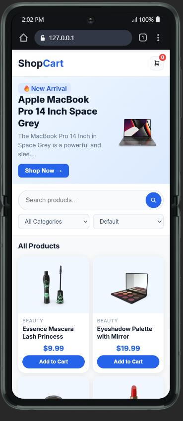
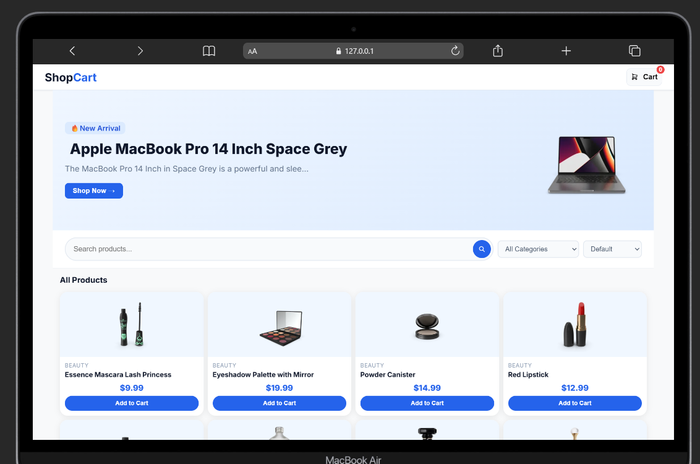

# 🛒 ShopCart

A modern and fully responsive mini ecommerce application built with Vanilla JavaScript using a modular and scalable architecture.

---

## 🚀 Live Demo

👉 https://shopcart-store.netlify.app/

---

## ✨ Features

- 🔍 Real-time product search
- 🗂️ Category filtering
- 💰 Price sorting (Low → High / High → Low)
- 🛒 Add to cart functionality
- ➕ Increase / decrease product quantity
- ❌ Remove items from cart
- 💵 Dynamic cart total calculation
- 📦 Load more products pagination
- 🎯 Dynamic hero banner using API data
- ⚡ Loading and error handling states
- 📱 Fully responsive mobile-first design

---

## 🛠️ Tech Stack

- HTML5
- CSS3
  - Mobile First Design
  - BEM Naming Convention
  - CSS Variables
- Vanilla JavaScript (ES6 Modules)
- DummyJSON API
- Netlify Deployment

---

## 📁 Project Structure

```bash
mini-ecommerce-app/
│
├── index.html
├── style.css
├── screenshots/
│   ├── mobile-view.png
│   └── desktop-view.png
└── js/
    ├── app.js       # entry point
    ├── state.js     # centralized state management
    ├── api.js       # API calls
    ├── ui.js        # DOM rendering
    ├── filters.js   # search, filter, sort
    └── cart.js      # cart logic
```

---

## ⚙️ Application Flow

1. Products are fetched from the DummyJSON API
2. Data is stored in a centralized state
3. Products are rendered dynamically on the UI
4. Search, sorting, and category filters update product state
5. Cart functionality manages quantity and total price updates

---

## 🧠 Concepts Practiced

- ES6 Modules (`import/export`)
- Async/Await
- Fetch API
- State Management
- Event Delegation
- Separation of Concerns
- Responsive Design
- Array Methods (`map`, `filter`, `find`, `reduce`)
- Dynamic DOM Rendering

---

## 🧪 Error Handling

The application handles multiple UI states:

- Loading state while fetching products
- API failure handling
- Empty search result handling
- Empty cart state handling

---

## 📸 Screenshots

### 📱 Mobile View



### 🖥️ Desktop View



---

## 🚀 Getting Started

### Clone the repository

```bash
git clone https://github.com/aniruddha-jadhav-15/mini-ecommerce-app.git
```

### Run the project

Open `index.html` in your browser or use Live Server.

---

## 📌 Future Enhancements

- 🛍️ Product details page
- ❤️ Wishlist functionality
- 🔐 User authentication
- 💳 Checkout flow
- 🌙 Dark mode support
- 🔎 Advanced filtering options
- ⚛️ Convert project to React
- 🟦 Add TypeScript support
- 🧪 Unit testing with Vitest

---

## 🙌 Author

**Aniruddha Jadhav**

- GitHub: https://github.com/aniruddha-jadhav-15
- LinkedIn: https://www.linkedin.com/in/aniruddhapj15/
- X (Twitter): https://x.com/aniruddha_JS

---

## ⭐ Support

If you found this project helpful, consider giving it a ⭐ on GitHub.
